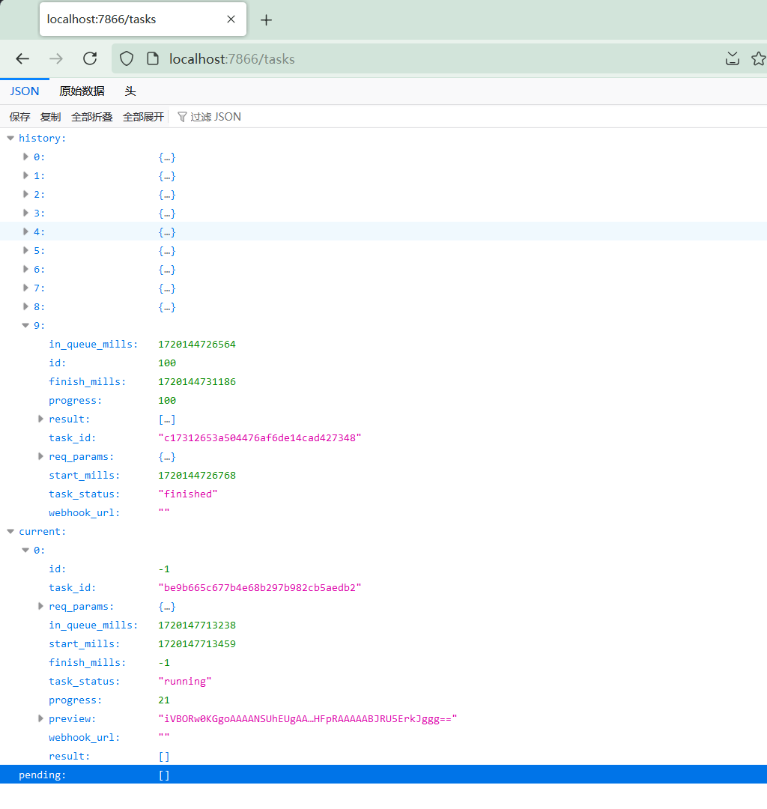

# 参数对照表

In next table, `AdvancedParams` is replaced with `adp`, and the rule of name change is to unify with Fooocus.

| Fooocus-API                              | FooocusAPI                           | 备注                  |
|------------------------------------------|--------------------------------------|---------------------|
| prompt                                   | prompt                               |                     |
| negative_prompt                          | negative_prompt                      |                     |
| style_selections                         | style_selections                     |                     |
| performance_selection                    | performance_selection                |                     |
| aspect_ratios_selection                  | aspect_ratios_selection              |                     |
| image_number                             | image_number                         |                     |
| image_seed                               | image_seed                           |                     |
| sharpness                                | sharpness                            |                     |
| guidance_scale                           | guidance_scale                       |                     |
| base_model_name                          | base_model_name                      |                     |
| refiner_model_name                       | refiner_model_name                   |                     |
| refiner_switch                           | refiner_switch                       |                     |
| loras                                    | loras                                | same, a list of lora obj |
|                                          | input_image_checkbox                 | this is always true      |
|                                          | current_tab                          | need not care this      |
| uov_method                               | uov_method                           |                     |
| **input_image**                          | **uov_input_image**                  | use variable name in Fooocus    |
| outpaint_selections                      | outpaint_selections                  |                     |
| **input_image**                          | **inpaint_input_image**              | use variable name in Fooocus    |
| inpaint_additional_prompt                | inpaint_additional_prompt            |                     |
| **input_mask**                           | **inpaint_mask_image_upload**        | use variable name in Fooocus    |
| adp.disable_preview                      | disable_preview                      |                     |
| adp.disable_intermediate_results         | disable_intermediate_results         |                     |
| adp.disable_seed_increment               | disable_seed_increment               |                     |
| adp.black_out_nsfw                       | black_out_nsfw                       |                     |
| adp.adm_scaler_positive                  | adm_scaler_positive                  |                     |
| adp.adm_scaler_negative                  | adm_scaler_negative                  |                     |
| adp.adm_scaler_end                       | adm_scaler_end                       |                     |
| adp.adaptive_cfg                         | adaptive_cfg                         |                     |
| adp.clip_skip                            | clip_skip                            |                     |
| adp.sampler_name                         | sampler_name                         |                     |
| adp.scheduler_name                       | scheduler_name                       |                     |
| adp.vae_name                             | vae_name                             |                     |
| adp.overwrite_step                       | overwrite_step                       |                     |
| adp.overwrite_switch                     | overwrite_switch                     |                     |
| adp.overwrite_width                      | overwrite_width                      |                     |
| adp.overwrite_height                     | overwrite_height                     |                     |
| adp.overwrite_vary_strength              | overwrite_vary_strength              |                     |
| adp.overwrite_upscale_strength           | overwrite_upscale_strength           |                     |
| adp.mixing_image_prompt_and_vary_upscale | mixing_image_prompt_and_vary_upscale |                     |
| adp.mixing_image_prompt_and_inpaint      | mixing_image_prompt_and_inpaint      |                     |
| adp.debugging_cn_preprocessor            | debugging_cn_preprocessor            |                     |
| adp.skipping_cn_preprocessor             | skipping_cn_preprocessor             |                     |
| adp.canny_low_threshold                  | canny_low_threshold                  |                     |
| adp.canny_high_threshold                 | canny_high_threshold                 |                     |
| adp.refiner_swap_method                  | refiner_swap_method                  |                     |
| adp.controlnet_softness                  | controlnet_softness                  |                     |
| adp.freeu_enabled                        | freeu_enabled                        |                     |
| adp.freeu_b1                             | freeu_b1                             |                     |
| adp.freeu_b2                             | freeu_b2                             |                     |
| adp.freeu_s1                             | freeu_s1                             |                     |
| adp.freeu_s2                             | freeu_s2                             |                     |
| adp.debugging_inpaint_preprocessor       | debugging_inpaint_preprocessor       |                     |
| adp.inpaint_disable_initial_latent       | inpaint_disable_initial_latent       |                     |
| adp.inpaint_engine                       | inpaint_engine                       |                     |
| adp.inpaint_strength                     | inpaint_strength                     |                     |
| adp.inpaint_respective_field             | inpaint_respective_field             |                     |
| adp.inpaint_mask_upload_checkbox         | inpaint_mask_upload_checkbox         |                     |
| adp.invert_mask_checkbox                 | invert_mask_checkbox                 |                     |
| adp.inpaint_erode_or_dilate              | inpaint_erode_or_dilate              |                     |
| **image_prompts**                        | **controlnet_image**                 | just change name            |
|                                          | generate_image_grid                  | new, default is better     |
| outpaint_distance_left                   | outpaint_distance                    | merge these to one       |
| outpaint_distance_right                  |                                      | use a list to pass these four      |
| outpaint_distance_top                    |                                      | exp: [100, 50, 0, 0]  |
| outpaint_distance_bottom                 |                                      | Directions are: left, up, right, down      |
| **upscale_value**                        | **upscale_multiple**                 | name change only               |
|                                          | preset                               | new, use this this specified preset  |
|                                          | stream_output                        | new, similar to LLM streaming output |
| **save_meta**                            | **save_metadata_to_images**          | name change only      |
| **meta_scheme**                          | **metadata_scheme**                  | name change only      |
| **save_extension**                       | **output_format**                    | name change only      |
| save_name                                |                                      | remove        |
| read_wildcards_in_order                  | read_wildcards_in_order              |                     |
| require_base64                           | require_base64                       | will be remove         |
| async_process                            | async_process                        |                     |
| webhook_url                              | webhook_url                          |                     |

simple is:

- All `AdvancedParams` move to upper level
- Modify some params name
    - `input_image` -> `inpaint_input_image`
    - `inpaint_mask` -> `inpaint_mask_image_upload`
    - `input_image` -> `uov_input_image`
    - `image_prompts` -> `controlnet_image`
    - `upscale_value` -> `upscale_value`
    - `save_meta` -> `upscale_multiple`
    - `meta_scheme` -> `save_metadata_to_images`
    - `save_extension` -> `output_format`
- Remove some params
    - `save_name`
- Add some params
    - `input_image_checkbox`
    - `current_tab`
    - `generate_image_grid`
    - `preset`
    - `stream_output`
- Merge some params
    - `outpaint_distance_left,right,top,bottom` 四个参数合并为 `outpaint_distance`

## Example for three types of return

### async task

specify `async_process` as `True`

```python
import requests
import json

endpoint = "http://127.0.0.1:7866/v1/engine/generate/"

params = {
    "prompt": "",
    "negative_prompt": "",
    "performance_selection": "Lightning",
    "async_process": True,
    "webhook_url": ""
}

res = requests.post(
    url=endpoint,
    data=json.dumps(params),
    timeout=60
)

print(res.json())
```

output will be like this:

```python
{'id': -1, 'task_id': '85c10c81e9e2482d90a64c3704137d3a', 'req_params': {}, 'in_queue_mills': -1, 'start_mills': -1, 'finish_mills': -1, 'task_status': 'pending', 'progress': -1, 'preview': '', 'webhook_url': '', 'result': []}
```

use `task_id` request `http://127.0.0.1:7866/tasks/{task_id}` to get task info, if this task is currently running, return should be include `preview`

example for return

```python
# pending
{
    "id": -1,
    "in_queue_mills": 1720085748199,
    "finish_mills": null,
    "progress": null,
    "result": null,
    "req_params": {
        # full request params
        ...
    },
    "task_id": "85c10c81e9e2482d90a64c3704137d3a",
    "start_mills": null,
    "task_status": null,
    "webhook_url": ""
}

# running
{
    "id": -1,
    "task_id": "85c10c81e9e2482d90a64c3704137d3a",
    "req_params": {
        ...
    },
    "in_queue_mills": 1720086131653,
    "start_mills": 1720086131865,
    "finish_mills": -1,
    "task_status": "running",
    "progress": 18,
    "preview": "a long text",
    "webhook_url": "",
    "result": []
}

# finished
{
    "id": 71,
    "in_queue_mills": 1720085748199,
    "finish_mills": 1720085770046,
    "progress": 100,
    "result": [
        "http://127.0.0.1:7866/outputs/2024-07-04/2024-07-04_17-36-09_5201.png"
    ],
    "req_params": {
        ...
    },
    "task_id": "85c10c81e9e2482d90a64c3704137d3a",
    "start_mills": 1720085748425,
    "task_status": "finished",
    "webhook_url": ""
}
```

### streaming output

this is like LLM streaming output, you will recieve from server until finish, refer to the above example:

```python
import requests
import json

endpoint = "http://127.0.0.1:7866/v1/engine/generate/"

params = {
    "prompt": "",
    "negative_prompt": "",
    "performance_selection": "Lightning",
    "stream_output": True,
    "webhook_url": ""
}

res = requests.post(
    url=endpoint,
    data=json.dumps(params),
    stream=True,
    timeout=60
)

for line in res.iter_lines():
    if line:
        print(line.decode('utf-8'))
```

you will get response like this:

```python
data: {"progress": 2, "preview": null, "message": "Loading models ...", "images": []}
data:
data: {"progress": 13, "preview": null, "message": "Preparing task 1/1 ...", "images": []}
data:
data: {"progress": 13, "preview": "data:image/png;base64,iVBORw0KGgoAAAANSUhEUgAAASAAAA...", 'message': 'Sampling step 1/4, image 1/1 ...', 'images': []}
data:
data: {"progress": 34, "preview": "data:image/png;base64,iVBORw0KGgoAAAANSUhEUgAAASAAAA...", 'message': 'Sampling step 2/4, image 1/1 ...', 'images': []}
data:
data: {"progress": 56, "preview": "data:image/png;base64,iVBORw0KGgoAAAANSUhEUgAAASAAAA...", 'message': 'Sampling step 3/4, image 1/1 ...', 'images': []}
data:
data: {"progress": 78, "preview": "data:image/png;base64,iVBORw0KGgoAAAANSUhEUgAAASAAAA...", 'message': 'Sampling step 4/4, image 1/1 ...', 'images': []}
data:
data: {"progress": 100, "preview": null, "message": "Saving image 1/1 to system ...", "images": []}
data:
data: {"progress": 100, "preview": null, "message": "Finished", "images": ["http://10.0.0.245:7866/outputs/2024-07-05/2024-07-05_09-31-10_1752.png"]}
data:
```

just modify our code:

```python
import requests
import json

endpoint = "http://127.0.0.1:7866/v1/engine/generate/"

params = {
    "prompt": "",
    "negative_prompt": "",
    "performance_selection": "Lightning",
    "stream_output": True,
    "webhook_url": ""
}

res = requests.post(
    url=endpoint,
    data=json.dumps(params),
    stream=True,
    timeout=60
)

for line in res.iter_lines(chunk_size=8192):
    line = line.decode('utf-8').split('\n')[0]

    try:
        json_data = json.loads(line[6:])
        if json_data["preview"] is not None:
            json_data["preview"] = "data:image/png;base64,iVBORw0KGgoAAAANSU..."
    except json.decoder.JSONDecodeError:
        continue
    print(json_data)
```

you will get this:

```python
{'progress': 13, 'preview': None, 'message': 'Preparing task 1/1 ...', 'images': []}
{'progress': 13, 'preview': 'data:image/png;base64,iVBORw0KGgoAAAANSU...', 'message': 'Sampling step 1/4, image 1/1 ...', 'images': []}
{'progress': 34, 'preview': 'data:image/png;base64,iVBORw0KGgoAAAANSU...', 'message': 'Sampling step 2/4, image 1/1 ...', 'images': []}
{'progress': 56, 'preview': 'data:image/png;base64,iVBORw0KGgoAAAANSU...', 'message': 'Sampling step 3/4, image 1/1 ...', 'images': []}
{'progress': 78, 'preview': 'data:image/png;base64,iVBORw0KGgoAAAANSU...', 'message': 'Sampling step 4/4, image 1/1 ...', 'images': []}
{'progress': 100, 'preview': None, 'message': 'Saving image 1/1 to system ...', 'images': []}
{'progress': 100, 'preview': None, 'message': 'Finished', 'images': ['http://10.0.0.245:7866/outputs/2024-07-05/2024-07-05_10-02-22_2536.png']}
```

it is better for frontend i think (but i am not good at this). with AI, i generate a [example.html](./docs/example.html), click `Generate` button, you will get a page with preview and progress.

### binary output

this is simple, return is a image, pass `async_process` and `stream_output` both `false`, at this time, `image_number` force to `1`

```python
import requests
import json
from PIL import Image
from io import BytesIO
import matplotlib.pyplot as plt

endpoint = "http://127.0.0.1:7866/v1/engine/generate/"

params = {
    "prompt": "",
    "negative_prompt": "",
    "performance_selection": "Lightning",
    "async_process": False,
    "stream_output": False,
    "webhook_url": ""
}

res = requests.post(
    url=endpoint,
    data=json.dumps(params),
    timeout=60
)

image_stream = BytesIO(res.content)
image = Image.open(image_stream)

plt.imshow(image)
plt.show()
```

# task query

Unlike [Fooocus-API](https://github.com/mrhan1993/Fooocus-API), the history saving will be automatic without a retention switch. The database is used with SQLite3 and stored in `outputs/db.sqlite3`. Taking lessons from the previous version, the table structure has been greatly simplified, and request parameters are stored as JSON in the `req_params` field. To reduce read and write operations, database operations are only performed when tasks enter and complete the queue. It is only used for generating records, and task status tracking is completed in memory.

In addition, this version will retain input images, uploaded images will calculate hash values and be saved in the `inputs` directory, and the image parameters in the database's `req_params` will be replaced with `url` information for saving, which means more complete historical record preservation, whether it is text-to-image or image-to-image or other types of images.

## /tasks

This is a compound interface, but its return format is fixed. The interface will always return JSON data in the following format, regardless of how the parameters are specified.

```python
{
    "history": [],
    "current": [],  # Although it is a list, there will be no more than one element in it.
    "pending": []
}
```

All elements have a format that matches the scheme in the database, except for current which has an additional preview, as shown in the following figure:



more usage, see below:

> The return format of this interface is always fixed, regardless of how the parameters are adjusted.

```shell
curl http://localhost:7866/tasks?query=current
# only return current task, other value for query include 'all', 'pending', 'history'

curl http://localhost:7866/tasks?query=history&page=3&page_size=5
# history and pending supports pagination and page size.

curl http://localhost:7866/tasks?query=history&start_at=2024-07-03T12:22:30
# You can specify a time range for the query, which will return all records within that time period. The time format is ISO8601, and if you do not specify end_at, it will be set to the current time.

curl http://localhost:7866/tasks?query=history&start_at=2024-07-03T12:22:30&action=delete
# Delete tasks within a specified time range, including database records and generated files. This is the only supported deletion method at present (input files will not be deleted).

curl http://localhost:7866/tasks/38ba92b188a64233a7336218cd902865
# This will return the information of the task, but it is just a dictionary. It is equivalent to taking the task with the specified task_id from the list above. If it happens to be the current task, it will also include preview. (Although it may look similar, this is actually another interface.)
```